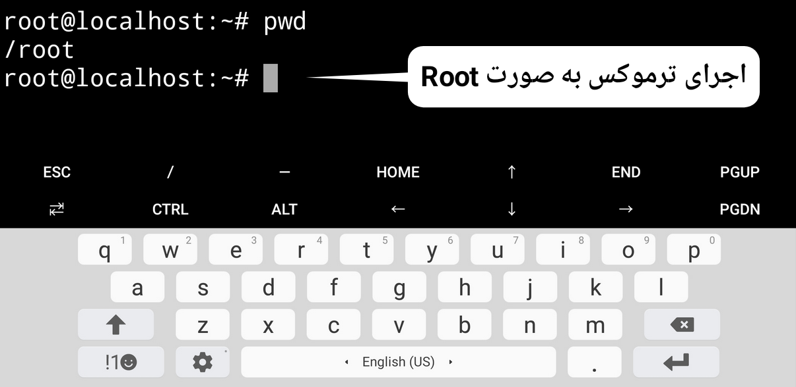

# install Root in the Termux

<h2>
آموزش نصب روت در ترموکس
</h2>
<h5> آیا تا حالا خواستید اسکریپت هایی اجرا کنید اما به دسترسی روت نیاز دارن یا به دلایلی میخواید دستوراتتون رو در محیط واقعی لینوکس وارد کنید؟ در این آموزش فقط با اجرای  یک اسکریپت ترموکس در حالت روت اجرا میشود</h5>
 
<h5>
ابتدا وارد ترموکس بشید و با دستور زیر اسکریپت رو دانلود کنید:
 <pre>
git clone https://github.com/HACKGM/root
</pre>
سپس با دستور زیر وارد پوشه اسکریپت بشید:
 <pre>
cd root
</pre>

سپس پکیج های زیر رو نصب کنید:
<pre>
pkg install wget
</pre>
<pre>
pkg install proot
</pre>
 
سپس اسکریپت را با دستور زیر اجرا کنید:
 
<pre>
bash install.sh
</pre>
 
در نهایت بعد از نصب و ساخته شدن فایل اجرایی محیط روت را با دستور زیر اجرا کنید:
<pre>
bash start.sh
</pre>
</h5>
 
<h5>
توجه: بعد از اجرای ترموکس به صورت روت نیازه تمام پکیج ها رو از اول نصب کنید و حتما بعد نصب ترمینال رو با دستورات زیر آپدیت کنید که در نصب پکیج ها مشکلی نداشته باشید:
 
<pre>
apt update
</pre>
<pre>
apt upgrade
</pre>
   
  دستور نصب sudo بعد از نصب اوبنتو:
 
  <pre>
  apt install sudo
  </pre>
</h3>
Channel Telegram:
<a href="Https://t.me/Hackgm">T.me/Hackgm</a>
 
